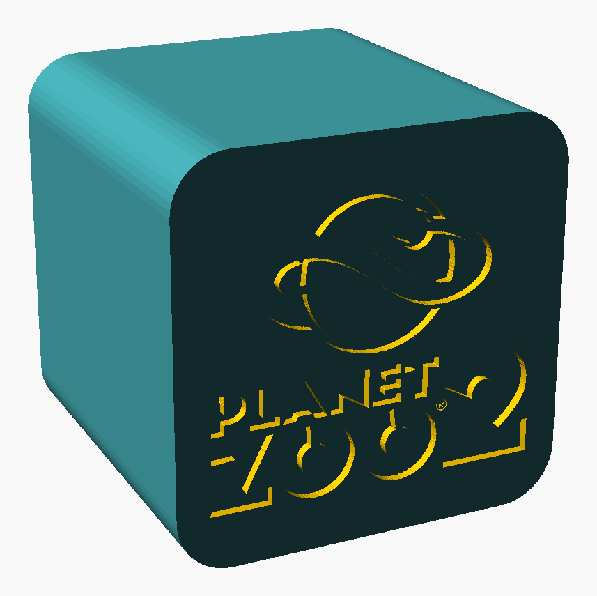

# Lysboks med Planet Zoo 2-logo (ca. 100 × 100 × 100 mm)

Parametrisk, 3D-printbar lysboks. Frontpanelet har **Planet Zoo 2-logoen** utskåret, slik at lyset skinner gjennom
(logoen er levert av bestilleren og er kun til eget bruk). Teksten «HUGO» og dyre-scenen er fjernet.

## Filer

| Fil | Innhold |
|---|---|
| `lysboks_planetzoo2.scad` | Hele modellen, alle mål som variabler øverst. Logoen ligger inline nederst (LOGO-DATA). |
| `stl/lysboks_frontpanel.stl` | Frontpanel med logo – svart/mørk PLA, forsiden ned |
| `stl/lysboks_hovedkropp.stl` | Hovedkropp (ring med 45° LED-list) – bakkanten ned |
| `stl/lysboks_bakplate.stl` | Avtagbar bakplate med USB-hull 12 × 8 mm – utsiden ned |
| `stl/lysboks_diffuser.stl` | Diffuserplate 0,8 mm – hvit PLA |
| `logo/` | Original-PNG og den vektoriserte polygonen |
| `tools/vectorize_logo.py` | Gjør en logo-PNG om til utskjæring med broer (kjør på nytt for annen logo/størrelse) |
| `previews/` | PNG-forhåndsvisninger |

## Mål og konstruksjon

* Ytre **100 × 100 × 100 mm** (`W`, `H`, `D` øverst – tolket som cm). Veggtykkelse 2,4 mm, flat bunn, hjørneradius 14 mm.
* Tre deler + diffuser: hovedkropp, frontpanel, avtagbar bakplate. Bakplaten klikker/glir på plass (toleranse `tol` = 0,2 mm pr. side, V-ribber), frontpanelet sitter med fire klosser med press-ribber.
* Lys: 5 V USB LED-stripe (WS2812B 10 mm) limes på 45°-flaten rundt innsiden. **16 mm** fra diffuser til nærmeste LED (krav ≥ 15 mm, sjekkes med `assert`).
* Alle deler printes uten support (ingen flater brattere enn 45°) og er under 256 × 256 mm.
* Eksporter på nytt: `openscad -D 'part="front_print"' -o stl/lysboks_frontpanel.stl lysboks_planetzoo2.scad` (`body_print`, `back_print`, `diffuser_print`). PNG-er: `tools/make_previews.sh`.

## Logo og broer

Lyse deler i logoen er skåret ut. Lukkede former (innsiden av P, A, de to O-ene, planeten) ville falt ut, så de holdes av
**2,0 mm broer** (stensil-stil), og små øyer (som ®) er fylt igjen. Kontroll: frontpanelets plast er **ett sammenhengende stykke**,
og alle faste steg er ≥ 0,8 mm (`tools/check_islands.py 100`). Bruk `logo_dz` for å flytte logoen opp/ned. Logoen er 84 mm bred.

## Printinnstillinger

Dyse 0,4 mm, **lagtykkelse 0,2 mm**, ingen support.

| Del | Farge | Vegger | Topp/bunn | Infill |
|---|---|---|---|---|
| Frontpanel | **Svart/mørk** PLA (må være ugjennomsiktig) | 3–4 | 6+ | 100 % |
| Hovedkropp | Hvit (best refleksjon) | 3 | 5 | 10–15 % |
| Bakplate | Hvit PLA | 3 | 6+ | 100 % |
| Diffuser | **Hvit** PLA (ikke silk), 4 lag à 0,2 mm | – | – | 100 % |

Tips: brim/lim mot vridning på diffuseren. 700 mm → her ca. 4 × 90 mm stripe (≈ 24 LED); begrens lysstyrken for USB-lader.

## Monteringsrekkefølge

1. Legg diffuseren i lommen på baksiden av frontpanelet (utsparinger rundt klossene).
2. Trykk hovedkroppen over klossene (diffuseren klemmes fast).
3. Lim LED-stripen på 45°-listen (kutt og skjøt i hjørnene), før USB-kabelen ut gjennom bakplaten.
4. Trykk bakplaten på – den klikker. Lirk den av med to små spor i bunnkanten bak.
