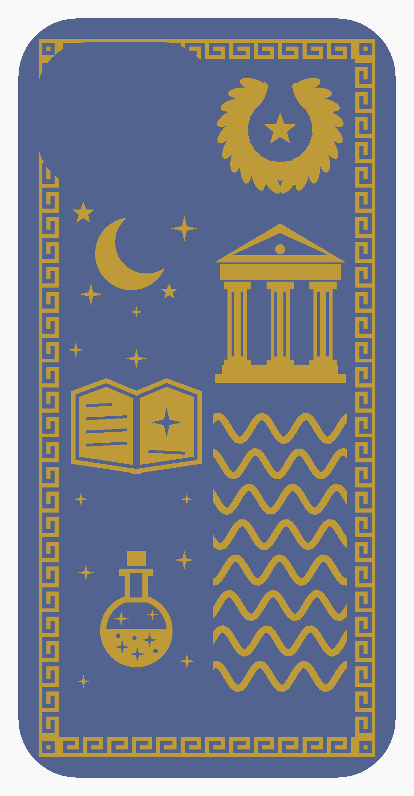

# iPhone 17e – deksel i TPU med hevet relieff (original design)

Parametrisk OpenSCAD-deksel. Baksiden har 0,6 mm hevet relieff: **venstre halvdel** (sett bakfra) magi – åpen gammel bok,
måne, stjerner, eliksirflaske med glitter; **høyre halvdel** gresk mytologi – tempel med søyler, laurbærkrans, bølger;
rundt kanten en **gresk meander** som binder halvdelene sammen. Alt er tegnet fra bunnen av, ingen eksisterende figurer eller logoer.

## Mål – hva er offisielt og hva er estimert

| Mål | Verdi | Status |
|---|---|---|
| Høyde × bredde × tykkelse | **146,7 × 71,5 × 7,80 mm** | **Offisielt** (Apple, iPhone 17e tekniske spesifikasjoner) |
| Utforming (hakk, ett bakkamera øverst til venstre, Action-knapp + volum på venstre side, på/av høyre, USB-C nederst med høyttalere på hver side) | – | Bekreftet fra produktomtaler (samme kroppsform som 16e/14) |
| Hjørneradius på telefonen | 10,0 mm | **Estimat – mål selv** |
| Kameraåpning (32 × 26 mm, midt 19,5 mm fra venstre og 17,5 mm fra toppen, sett bakfra) | – | **Estimat – mål selv** |
| Knapper: Action 24/9, vol opp 38,5/14,5, vol ned 55/14,5, på/av 45/21 (avstand fra toppen til midten / lengde, mm) | – | **Estimat – mål selv** |
| USB-C-åpning 13 × 6 mm, høyttalerhull 2 × 4 (Ø 2,4, avstand fra midten 17,5 mm) | – | **Estimat – mål selv** |

Apple publiserer ikke hjørneradius eller plassering av kamera/knapper/porter, og jeg fant ingen pålitelige målskisser, så
disse er anslått. Alle ligger som variabler øverst i `iphone17e_deksel.scad` (merket «USIKKER»). Mål med skyvelære og juster
før du printer hele dekselet; en test-print av bare de nederste 15 mm er raskt.

**Toleranse** `tol = 0,3 mm` er total slark pr. mål (0,15 mm pr. side). Vil du ha 0,3 mm pr. side, sett `tol = 0.6`.
Veggtykkelse 1,5 mm, bakplate 1,5 mm. Kanten går 1,0 mm inn over skjermen (`lip_over`); kantens topp står 1,8 mm over glasset.

## Viktig om print uten støtte (les dette)

* **Alt unntatt relieffet er støtte-fritt:** kanten over skjermen har 45° underside, de fleksible knappene (veggen tynnes
  innenfra til 0,6 mm, taket skrått ca. 42°), USB-C-åpningen (sekskant) og høyttalerhullene (dråpeform) er avfaset. Kun mikroskopiske flate topper (≤ 2,2 mm bro) gjenstår.
* **Hevet relieff + baksiden ned er fysisk i konflikt:** relieffet stikker *ned* mot byggeplaten, så bakplaten mellom
  relieffene ligger 0,6 mm over plata og må bygges i luft (ca. 7 750 mm², målt i STL). Det går ikke i TPU uten hjelp. Tre løsninger:
  1. **Avtrekksfilm (anbefalt, ingen slicer-støtte):** last `iphone17e_avtrekksfilm.stl` inn sammen med `iphone17e_deksel_komplett.stl`
     (samme koordinater). Filmen er et 0,4 mm ark under bakplaten med 0,2 mm luft over, og dras av etter printing.
     *Ikke testprintet – jeg har ikke fysisk printer. Test på en liten bit først.*
  2. **Slicer-støtte kun fra byggeplate**, 0,2 mm Z-avstand, ingen interface – gir samme effekt.
  3. **Flatt innlegg** (`stl/flatt_innlegg/`): relieffet ligger i 0,6 mm lommer, helt flatt, printes uten noen støtte og i flere farger. Du mister følbar høyde.
* Relieffet kan skilles ut: `iphone17e_deksel_base.stl` + `iphone17e_relieff.stl` ligger i samme koordinater (relieffet z 0–0,6,
  bakplaten fra z 0,6) – last begge som deler i samme objekt i slicer, og tildel relieffet en annen filament/farge (AMS).

## Filer

| Fil | Innhold |
|---|---|
| `iphone17e_deksel.scad` | Hele modellen, alle mål som variabler øverst |
| `stl/iphone17e_deksel_komplett.stl` | Deksel + relieff i ett legeme (74,8 × 150,0 × 11,9 mm) |
| `stl/iphone17e_deksel_base.stl` + `stl/iphone17e_relieff.stl` | Delt for flerfarge (AMS) |
| `stl/iphone17e_avtrekksfilm.stl` | Valgfri støtte-erstatning (se over) |
| `stl/flatt_innlegg/` | Variant uten hevet relieff (`relief_mode="inlay"`) |
| `previews/` | PNG: forfra, bakfra, fra siden, bunn, skrått, snitt |

Eksport på nytt: `openscad -D 'part="case_print"' -o x.stl iphone17e_deksel.scad` (andre deler: `base_print`, `relief_print`, `film_print`;
flatt innlegg: legg til `-D 'relief_mode="inlay"'`). Forhåndsvisninger: `../tools/make_previews_17e.sh`.

## Printinnstillinger (TPU 95A)

* Dyse 0,4 mm, lagtykkelse **0,2 mm** (0,16 mm gir penere relieff). Printes **liggende, baksiden ned**, åpningen opp.
* Hastighet **20–30 mm/s** (relieff og første lag 15–20), **direct drive** anbefales; Bowden går, men senk hastigheten.
* Temperatur etter produsent (typisk 220–230 °C), seng 40–60 °C. Slå av/minimer retraksjon (0–1 mm), vifte 30–60 %.
* Vegger **3 linjer** (1,2 mm) – veggen er 1,5 mm, så bruk 4 linjer (1,6 mm) hvis slicer-en tillater «tynne vegger». Topp/bunn 4–5 lag, **infill 10–15 % gyroid** (platen er bare 1,5 mm).
* Skjørt/brim 3–5 mm hjelper på feste. Ikke bruk «ironing».
* Fleksible knapper (0,6 mm vegg) blir 1–2 linjer: slå på «gap fill»/«tynne vegger».
* Relieffdetaljer: minste linje 0,5 mm (fluting i søyler, tekstlinjer i boka); meander 0,8 mm. Spisse stjernespisser blir avrundet.
* Fargebytte (AMS): bytt filament på lag 0–0,6 mm (relieffet er første 3 lag), eller bruk relieff-STL som egen del.
* Dekselet er ca. 74,8 × 150 mm – passer fint på alle vanlige bygg-plater.

## Kontroller som er kjørt

* Telefon-«dummy» (146,7 × 71,5 × 7,8, r = 10) legges i dekselet: **0 mm³ overlapp** (`part="clash_phone"`).
* STL-ene er lukkede legemer (hver kant delt av to flater). Overheng (`tools/check_stl.py`): base 18 småflater / 3,4 mm² (flate topper på USB/høyttaler), komplett 0,6 mm-underside som beskrevet over.
* Relieffet er holdt ≥ 1,5 mm unna kameraåpningen (`cam_margin`); meander-båndet avbrytes der kameraet kutter det.
* Snitt av kant, bakplate+relieff og knappemembran: `previews/07_snitt_tverr_knapp_og_kant.png`.
